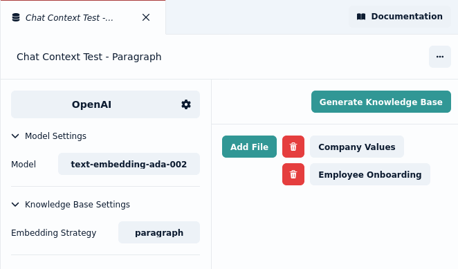
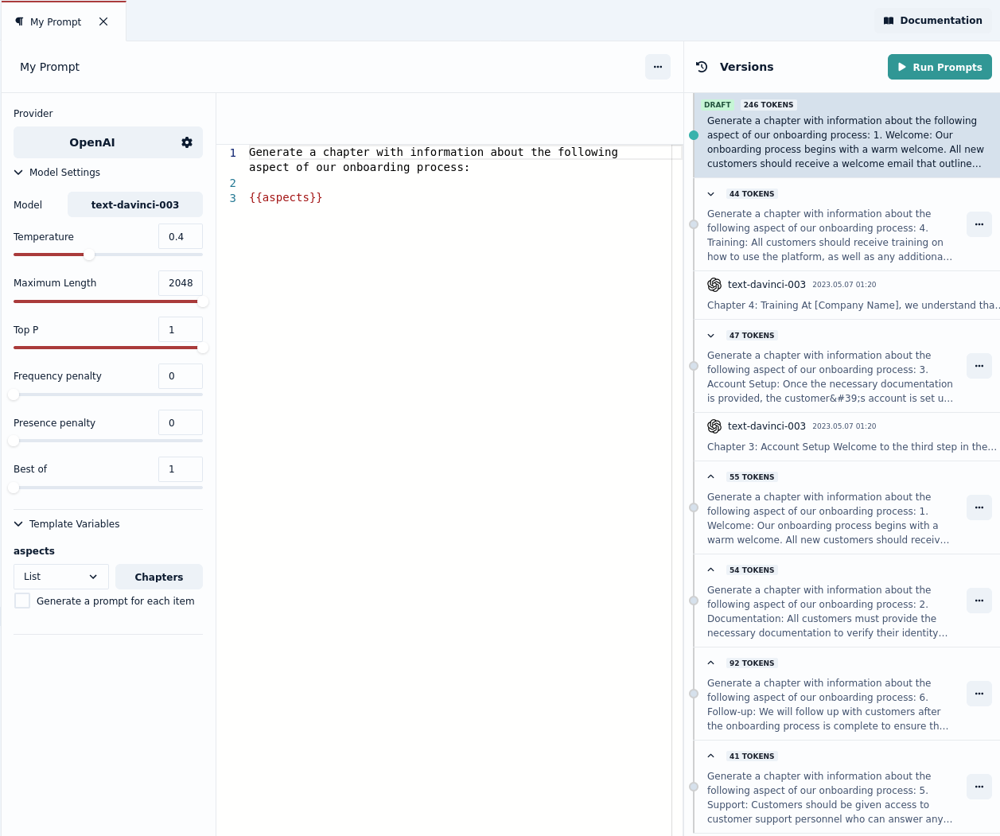

Our focus this week was adding knowledge bases to Prompt Studio, allowing you to circumvent limitations with prompt lengths, and test interactions with your own data.

## Knowledge Bases

When generating content through prompts you sometimes want to make some information available to the language model that it was not trained upon. This could be because the data was not available at the time of training or because the data you want it to use is very specific.

To get the results you want, you need to pass that information as part of the prompt you send to the language model. With that context the model will be more accurate in its responses.

However language models limit the number of tokens that can be provided as part of a prompt, this means that if you have a lot of information that you want to be include in the prompt, you need a way to decide what parts are the most relevant in a given situation. There are many ways to do that, a very popular approach is to do a vector similarity search, where the parts of the text that are most similar with the user query are passed as context.

You can now setup a knowledge base to do just that in Prompt Studio.

### Adding files to a knowledge base

To build a knowledge base in Prompt Studio, create a new asset of type "knowledge base". And link the files you want to be part of the knowledge base. Then click "generate knowledge base".

## Chat Context

We added the concept of chat contexts to Prompt Studio. You can use your knowledge base in a chat by selecting it under "chat context". This allows you to ask questions in the chat about the files in your knowledge base.

Let us know how you use knowledge bases and what features you would like to see added next.

## UX improvements

This week we also improved the useability of prompt versions. You can now easily revert to a previous version of your prompt template, including previewing the number of tokens each prompt will use.

