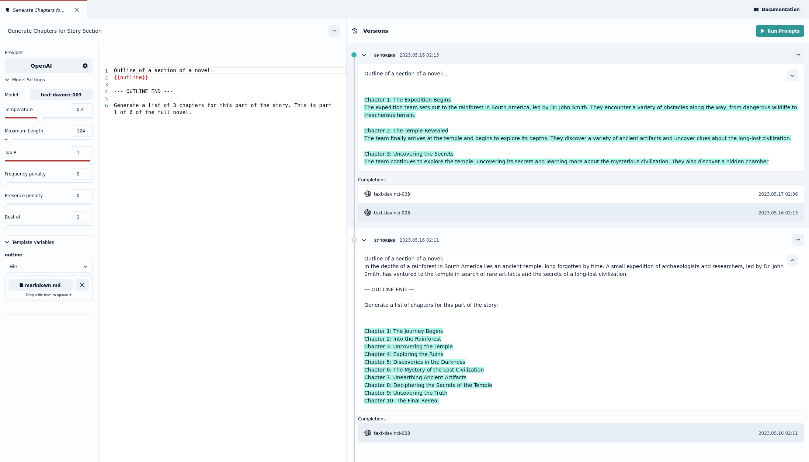

This week we made working with files a lot easier by introducing inline assets. You no longer need to create separate file assets and pass them to your prompts or knowledge bases. You can now drop the file directly onto your prompt variable or onto your knowledge base.

Stay tuned for next week when we bring a new custom API provider for you to connect to your own language models.

## Inline Assets

Inline assets are just like normal assets with the difference that they live only within the scope of another asset. This makes it a lot easier for you to keep your workspace de-cluttered. If you are only going to use one of your files in a single knowledge base there is no point for it to live on your workspace. Simply create the inline file asset by dropping the file onto the knowledge base. If you no longer need the knowledge base, all inline assets that were created as part of it will be deleted along with it. If you later want to use your file elsewhere, you can always convert it into a primary asset.

### Adding files

To add a file to a knowledge base in Prompt Studio, you can now simply drag and drop it onto the knowledge base:

You can do the same in a prompt. Keep in mind that the file size might push your prompt above the limit for your selected model.

## UX improvements

This week we further improved the how prompt versions are presented in prompt studio. This new setup separates the template view from the prompts and completions so that you can view all of them at the same time. Figuring out the most convenient setup for this new type of development experience is still a work in progress, let us know what you think of our most recent changes!

