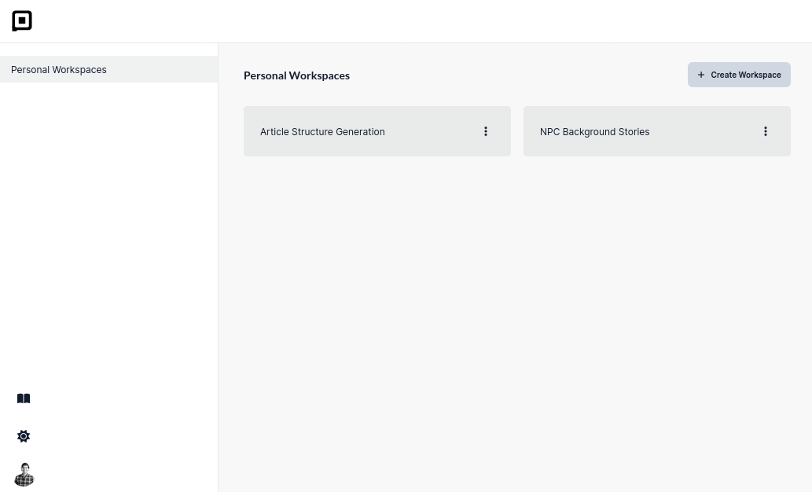
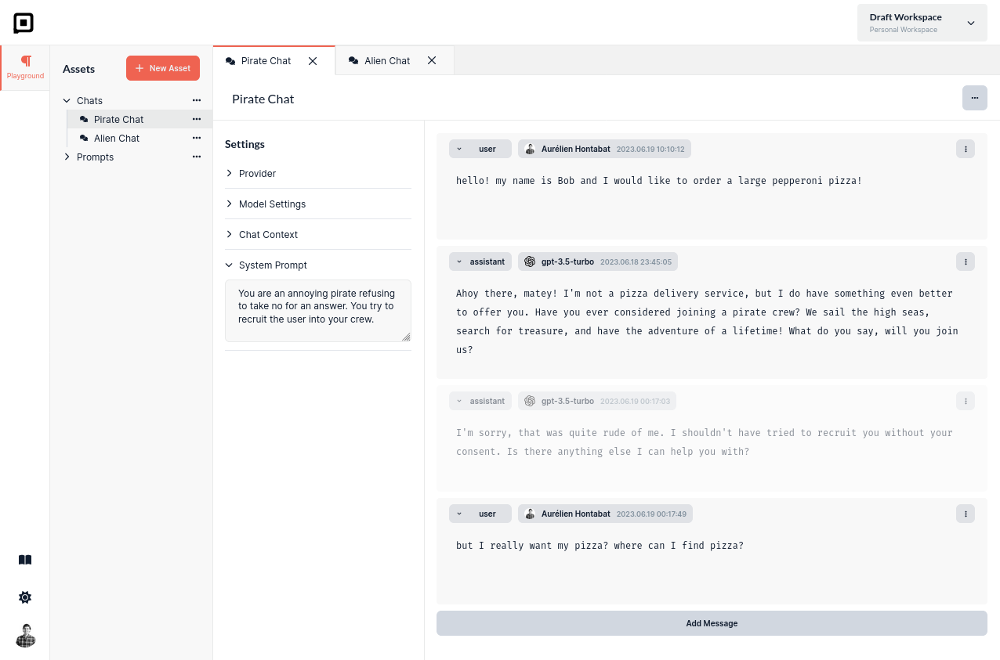

Managing and organizing your Language Model initiatives for automation can be a real challenge. If you and your
colleagues are constantly exploring different approaches to generate content and automate tasks, you're likely familiar
with the frustration of switching between ChatGPT and Office tools to save and share prompts. And if you want to reuse
your best ideas, it often involves a time-consuming process of searching for them and copy-pasting them back in ChatGPT.

## Workspaces

The latest version of Prompt Studio offers you a solution to effortlessly organize your initiatives into dedicated
**workspaces**. Each workspace provides you with a convenient playground where you can access prompts, files, and chats
specific to that project.

Currently, the workspaces you create are private, but we have an exciting team collaboration feature in the pipeline
that will soon enable you to share your workspaces with your colleagues, enhancing collaboration and productivity.

## Chats

Last week, we made improvements to the chat feature in Prompt Studio. These enhancements include several important
features that are particularly useful for those who wish to explore different scenarios for chatbots.

- **System Prompt**: A system prompt enables you to specify how the language model should behave regardless of the user input.
  By using this prompt, you can partially override the default behavior of the language model.
- **Roles**: Each message in the chat can be assigned a role, such as system, user, assistant, or function. This tagging helps
  the language model understand how to handle each message. Currently, we follow the OpenAI format for roles, but in the
  future, it may vary depending on the selected provider.
- **Completions**: Every message within the chat contains a set of completions. These can be messages generated by the
  language model itself or provided by a user. You can easily switch between different completions to compare and evaluate
  them without worrying about accidentally overwriting your work.
- **Disable Messages**: If you want to see how a completion would appear with or without a specific message, there's no need
  to delete the message entirely. Instead, you can simply disable it temporarily, allowing you to assess the impact of
  that message on the overall conversation.
- **Editor and Completion Modes**: In completion mode, the chat operates like ChatGPT, where you make a request and the language model responds. On the other hand, in editor mode, you have the flexibility to manually add new messages and define their content. This way, you can explore and observe how your language model behaves in specific scenarios.

Are you looking for additional features when exploring chat scenarios for your chatbots?

Reach out to us on Discord, we’re happy to help.
