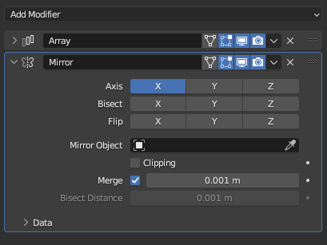

During the 1990s, as computers reached a level of processing power capable of supporting 3D animation, several 3D modeling software emerged, providing artists with the opportunity to express themselves in this new medium.

The technology at that time had limitations; rendering complex scenes was time-consuming due to extensive computational requirements. Additionally, achieving realism and intricate detail was almost impossible, and artists wanting to enter the field encountered a steep learning curve. Nonetheless, these obstacles did not prevent the 3D modeling software of that era from setting the stage for significant progress in digital art and animation.

3D animation wasn't just another method for crafting traditional animations; it introduced an entirely new and distinct style of animation, replete with its own distinct challenges and opportunities. Today, both approaches coexist and complement one another.

We currently experience a similar revolution with text. The content we generate through LLMs has a distinct feel to it and sometimes struggles to match our expectations in terms of quality or accuracy. But it also comes with its own advantages: we can shape it using instructions and guidelines and explore different ideas simultaneously and automatically. This procedural text invites interaction and, when provided with the right boundaries and structure, has the potential to independently develop into substantial narratives.

The big question is how do we retain creative control over it and how will the tools we use to interact and shape it look like. So let me talk a bit about the approach we are taking at Prompt Studio.

## Modifiers

A modifier is simply a tool that transforms your text without making irreversible changes. A modifier contains some rules, and given text it will return a modified version of it. A very simple modifier is a template. A template takes text and variables. Given the text `“hello {{name}}!”` and the variable `{ name: “mumin”}` , the template returns the text “hello mumin!”.

There are thousands of modifiers we can think of, from collapsing text above a certain number of tokens by summarizing it, to transforming text into a different writing style, to extending text with information from a knowledge base.

Since Prompt Studio allows you to work with text and chat, our modifiers will support both formats as well.

_A stack of modifiers in Blender._

## Flows

Sometimes you need to create flows to achieve the results you are looking for. A flow is a combination of modifiers, adapters (external tools) and inputs (UI/API), that generates either text or a chat message. In a flow you pass data from one node to another by connecting them, giving you full control over how text is generated, without having to write code. These editors are great for prototyping and are very common when working with procedural assets in other tools like Blender.

While we continue working on collaboration features we are also migrating our backend to work with flows. Under the hood our prompt and chat interaction editors will be editing a flow, and tracking its results. This makes our whole platform a lot more flexible and modular. Adding new functionality can simply be done by creating new modifiers/adapters. While we currently don’t allow flows to be edited directly, we plan to add a node editor to Prompt Studio when we introduce our workflow features.

_Shader editor in Blender used to create Materials._

Both our flow engine and our modifiers are open source and available (as early versions) on [Github](https://github.com/pufflyai/prompt-studio-core).

Have ideas for modifiers you would like to see us add to Prompt Studio? Let us know on our Discord!
