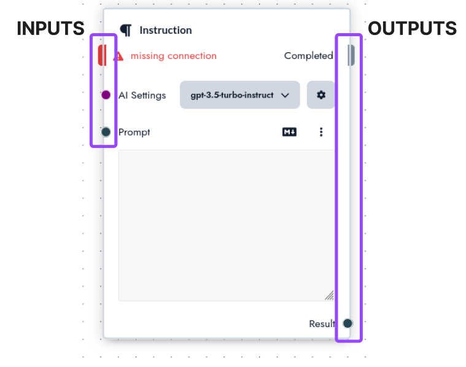
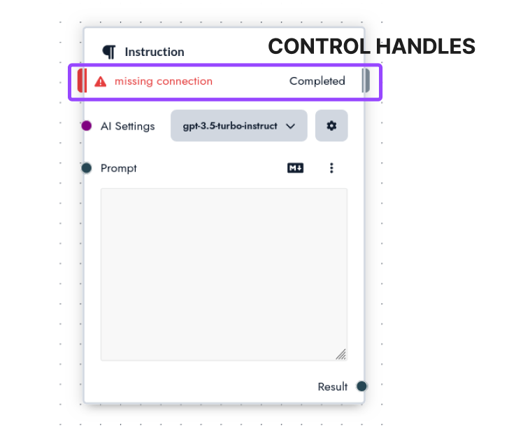

# Instructions

In Prompt Studio, an instruction is a command to a Language Model. It is a [prompt](/concepts/prompts) formatted in a specific way before being provided to an LLM allowing it to solve your task effectively. Instructions can also be used to ensure results follow certain formats.

Prompt Studio allows you to split your [tools](/concepts/tools) into a series of instructions using the tool editor. By splitting more complex tools in a series of independent instruction you can:

1. improve the quality of the results you get
2. identify what parts of a task an LLM struggles with
3. keep how a task is solved transparent

## Format

Instructions receive inputs and produce outputs, what inputs and what outputs they produce depend on the instruction you are using.

Inputs are listed to the left, outputs to the right.

Besides inputs and outputs instructions also need to be connected via the **control** handle. If this handle is not connected the instruction will not run and an error message will be displayed.

## Inputs and Output types

Instructions can receive values of different types, each type is indicated by a different color.

- **AI Settings** these settings contain a language model and the corresponding parameters that should be provided to the language model
- **Text** text can come either from a file, template or as the result of an instruction.
- **Options** options are different values that can be selected
- **List** a list of text

## Instruction types

How prompts are presented to a language model makes a big difference regarding the quality of the results you will get. If you are completing a table, analyzing documents or simply want to build a Q&A system, there are different pitfalls to consider.

Below is a list of currently available instructions and when to use them.

- [Instruction](/instructions/instruction) : will provide your prompt to a language model without any transformation besides inserting variables. For prompts that exceed the context length of the target llm, the start and end of the prompt are preserved while the center is summarized.

- [Checklist](/instructions/table): will run your prompt sequentially over a document of variable length and fill a table with parameters you requested. The full document is provided to the LLM as is to ensure no information is missed. This Instruction type is ideal for analyzing documents, running checklists or extracting information from unstructured data.

## Instruction Playground

::: warning Under Construction

The documentation for Prompt Studio is currently under construction. If you have any questions about how Prompt Studio
works you can reach us in our [discord](https://discord.gg/3RxwUEk8fW), or you can send us an email at `support@prompt.studio`.

:::
