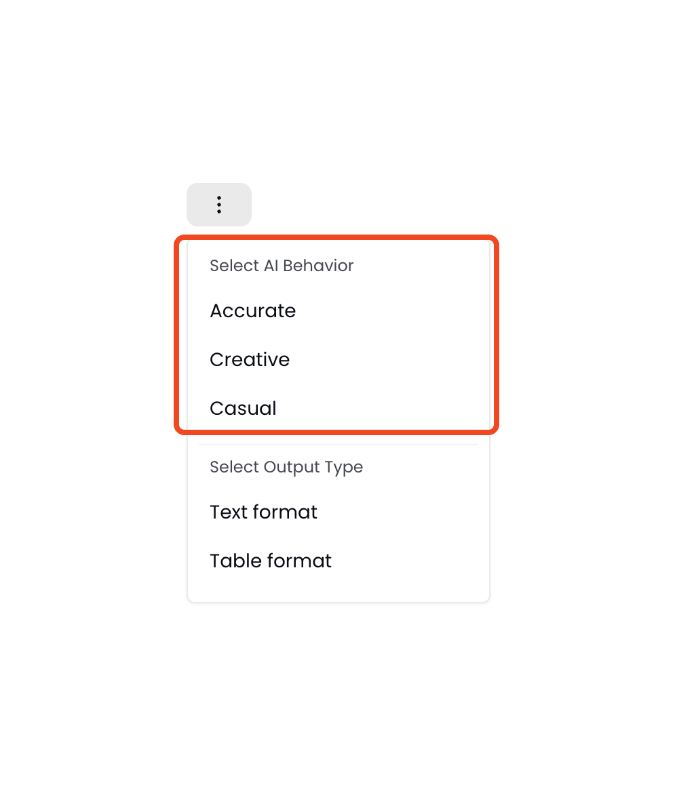
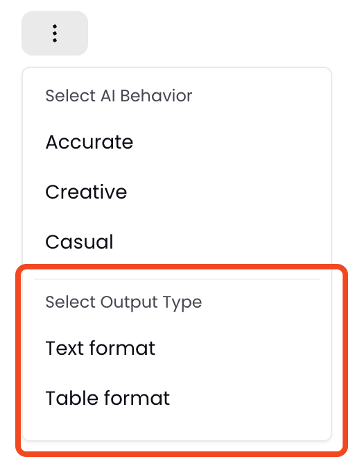
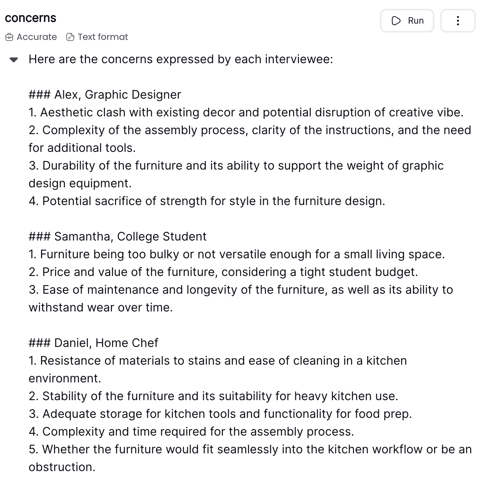
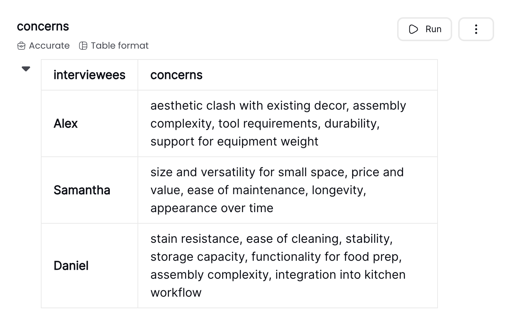
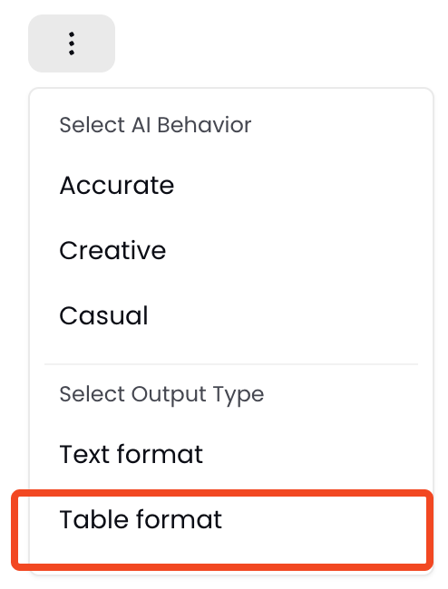

# Instructions

In Prompt Studio, an instruction is a command to a Language Model. It is a [prompt](/concepts/prompts) formatted in a specific way before being provided to an LLM allowing it to solve your task effectively. Instructions can also be used to ensure results follow certain formats.

Prompt Studio allows you to use several instructions in your recipe. By splitting more complex logic in a series of independent instructions you can:

1. improve the quality of the results you get
2. identify what parts of a task an LLM struggles with
3. keep how a task is solved transparent

::: warning Default behavior of multiple instructions in a recipe

If you have an instruction in your recipe, and you add another instruction in the same recipe, then the second instruction is not related in any way to the first instruction; unless you reference the output of that first instruction. More on chaining instructions [here](#chained-instructions-in-a-recipe)

:::

## Chained instructions in a recipe
In a lot of cases, you might want to use the output of an instruction in another instruction. Let's take a very simple example where in the first instruction, you want the LLM to extract concerns expressed by interviewees from a file containing the interview scripts. Then in the second instruction you want the LLM to suggest solutions to those concerns.  

In the first instruction, we're passing a [File](file.md) containing the interviews to the instruction by typing `/interviews` as follows:

```

Based on the following interviews: /interviews, list the concerns expressed by the interviewees
```

In the second instruction, we want the LLM to suggest solutions based on the concerns extracted from the first instruction. For that, we're referring to the output of the first instruction with `/concerns`. The second instruction looks like this:

```
Based on the following concerns: /concerns, suggest a solution that would make the interviewee happy
```

This is the flow when you run the second instruction:
1. The first instruction runs, we get the output called `/concerns`. Let's say the content of the output is `the couch is too small`
2. The second instruction will run and replace `/concerns` with `the couch is too small`


## AI behavior of an instruction
Setting a specific AI behavior would tailor the model's output and interaction style to your specific needs or preferences. This customization can affect how the model generates responses, the tone and style of those responses, and the model's focus on certain types of information or modes of interaction. 

You can currently select one of three AI behaviors: accurate, casual and creative. We are soon going to allow you to create your own AI presets where you combine LLM parameters like temperature, top-p, top-k, etc.

This is how you pick an AI behavior: 


### Accurate AI behavior
This mode would be particularly valuable in professional, academic, or any context where the stakes of misinformation are high, and where you rely on the LLM for accurate and reliable information. If you pick this behavior, the model would focus on generating responses that are factually correct, precise, and based on well-established information. If you are providing context to the instruction by uploading a file for example, then this setting would ensure that the LLM generates a response that is consistent with the data in your file.

### Casual AI behavior
If you Set the AI behavior to **casual**, the model will generate responses in a relaxed, informal tone, rather than in a professional or formal context. It might use colloquial language like "I'm" instead of "I am", and possibly slang, depending on the desired level of informality. This setting might adjust not just the language style but also the model's approach to topics, opting for less technical explanations where appropriate.

### Creative AI behavior
Setting the AI behavior to **creative** means the LLM would prioritize originality, innovation, and the generation of unique ideas over more conventional or predictable responses. This adjustment encourages the model to explore a wider range of possibilities and produce outputs that are imaginative and inventive, suitable for tasks such as creative writing, brainstorming, and generating novel solutions to problems. This creative mode is particularly valuable when the goal is to push the boundaries of conventional thinking and generate content that stands out for its originality.

## Output format
You can set the output format of an instruction to either **text** or **table** as seen below, to ensure that the model returns the result in a format that works better for your specific task.




### Text format
Text output is ideal for narrative responses, explanations, creative writing, or any scenario where a flowing, continuous form of information is preferred. 

### Table format
Table output is invaluable for organizing data, comparisons, statistical information, or any content where structure and quick reference are key. Tables make it easier to digest complex information at a glance, facilitating analysis and decision-making processes. More on how to set the table to guide the LLM [here](#how-to-return-output-in-a-table-format).

### Example of text and table formats
If we go back to the previous instruction where we extracted the concerns expressed by interviewees, this is how the output would look like in the case of **text** output (left image) and **table** output (right image)




### How to return output in a table format?

#### Step 1: Select table output format


#### Step 2: Fill the table in the instruction field
In the video below, I write the two columns or fields that I want the LLM to fill out. In this case, I want it to extract the interviewees and to write the concerns of every interviewee. 

<div style="position: relative; padding-bottom: 53.22916666666667%; height: 0;"><iframe src="https://www.loom.com/embed/db4338f9a2d14b0fabb1efec3b2e206d?sid=2ad6a959-4a2c-4243-af6f-3503cb9b1d2f" frameborder="0" webkitallowfullscreen mozallowfullscreen allowfullscreen style="position: absolute; top: 0; left: 0; width: 100%; height: 100%;"></iframe></div>
