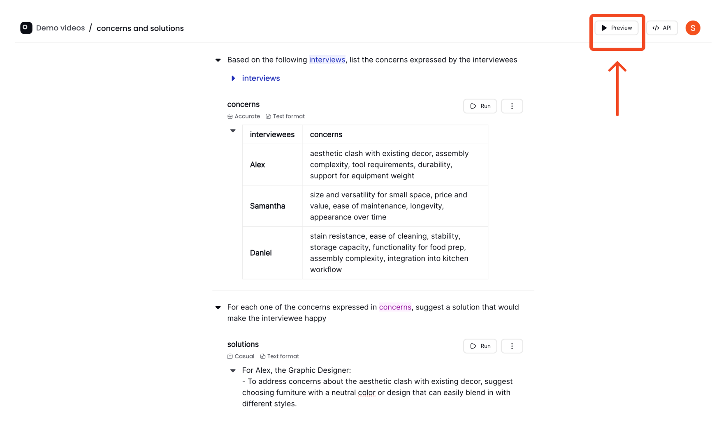
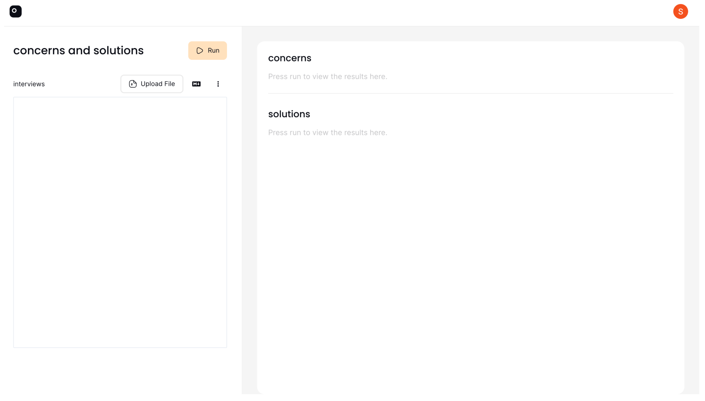
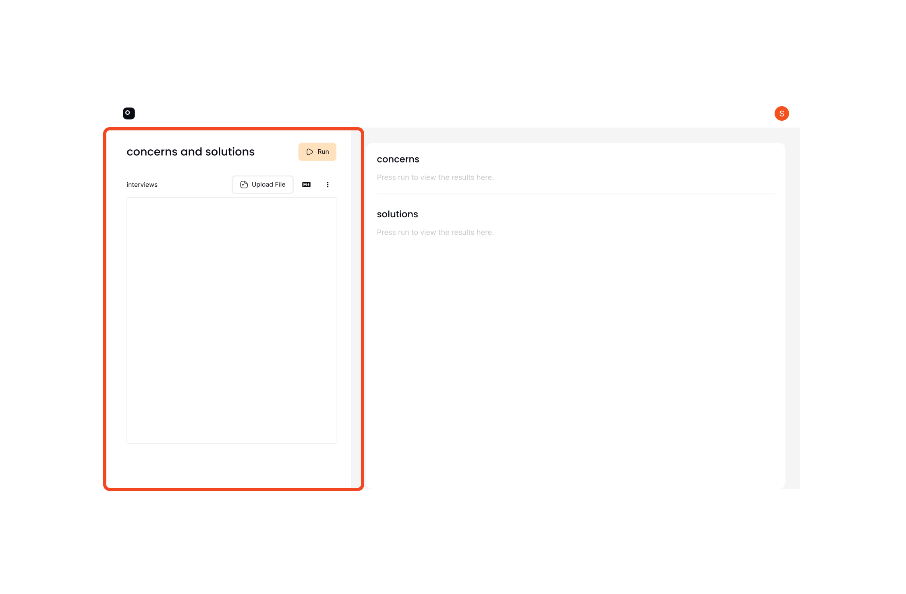
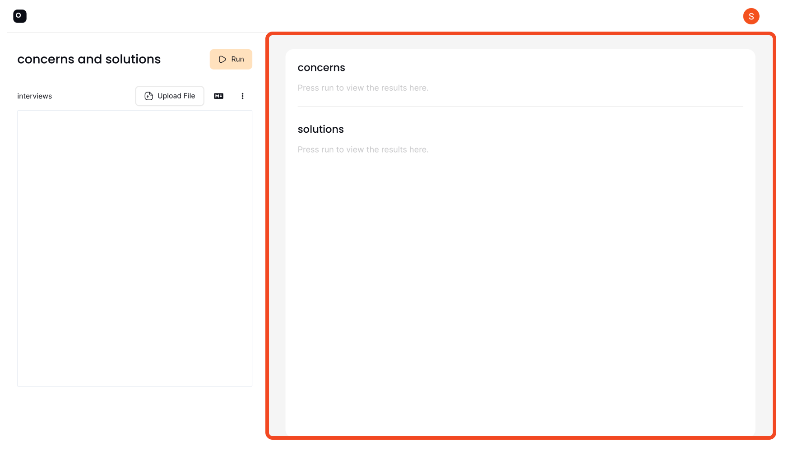
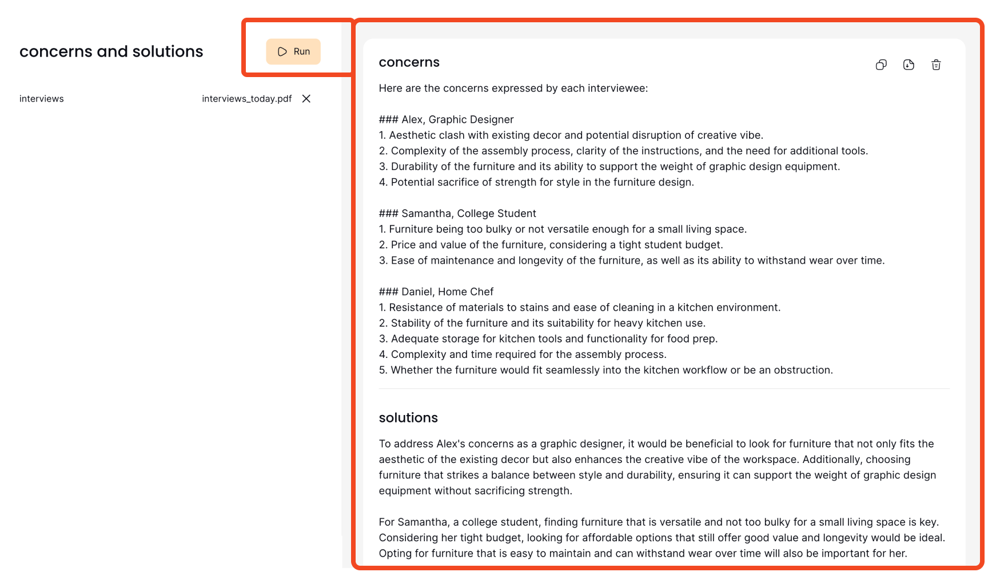

# Preview

Previewing your [recipe](recipe.md) in Prompt Studio is a straightforward process that allows you to test and interact with your creation in real-time. Follow these simple steps to see your recipe in action:

## Step 1: Locate the Preview Button

To begin the preview, look for the **Preview** button situated on the top right side of the recipe page.

## Step 2: Open the Preview Page

Click the **Preview** button. This action will open a new browser tab, taking you to the preview page where you can interact with your recipe. Back to the [Recipe](instructions#chained-instructions-in-a-recipe) that we had built earlier, we have two instructions. In this case, I want to test my recipe by uploading an interview file and seeing what concerns it extracts (1st instruction) and what solutions it suggests(2nd instruction). This will help me refine my prompt better. 

## Step 3: Interact with Your Recipe

On the preview page, you will find the input fields to the left. These fields are dynamic and will reflect the [file](file.md) references that you wrote in your instructions.

To the right, the outputs of the instructions inside of your recipe will be displayed. In the case of this [recipe](instructions#chained-instructions-in-a-recipe), it's the outputs of the concerns instruction and the solutions instruction.

### Real-Time Updates

Any modifications you make to your recipe will be instantly reflected in the preview. This allows you to test and iterate quickly.

## Step 4: Running the Preview

To execute your recipe within the preview, simply click on the `Run` button located in the preview tab. The output of the instructions will show up on the right side.

