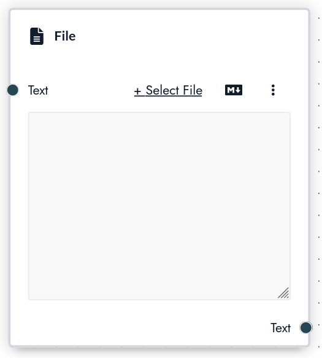

# File

The **file node** allows you to use files in a [tool](/concepts/tools). To upload a file simply click on "Select File" you will be able to upload a new file or select a previously uploaded file.

Supported formats are `.txt`, `.csv`, `.pdf`, `.md`.

## Inputs

The file node has the following inputs:

**`Text`** content of the file, _ignore this if you just want to upload a file_

## Outputs

**`Text`** content of the file
