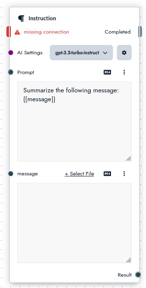

# Instruction

The default instruction will provide your prompt to a language model without any transformation besides inserting variables. For prompts that exceed the context length of the target llm, the start and end of the prompt are preserved while the center is summarized.


## Inputs

The Instruction node has the following inputs:

**`Control`** if this field is not connected the instruction will not run

**`AI Settings`** what [language model](/concepts/llms) and parameters to use to complete the instruction

**`Prompt`** The [prompt](/concepts/prompts) to provide to the language model

## Outputs

**`Results`** The resulting values generated by the LLM

## Adding variables

When you add a variable to the instruction node a new text input will appear that you can connect to. You can add a variable in the prompt using curly brackets, e.g.:

```
Summarize the following message: {{message}}
```



You can now connect a file, template or another instruction to the message input.
