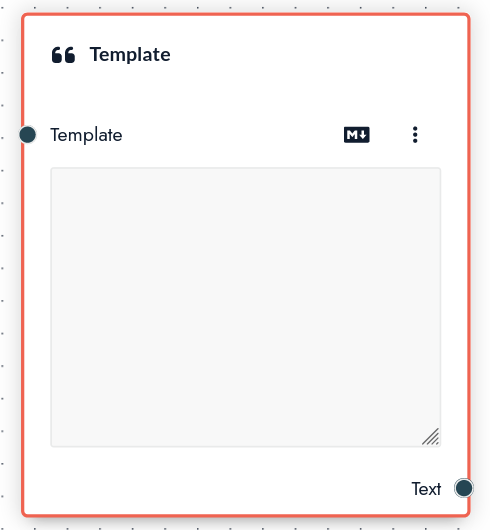
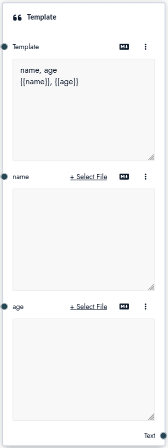

# Template

The **template node** allows you to join different inputs together. This can be helpful to create text that follows a specific format.

At first glance the template node looks a lot like the [file](/nodes/file) node. The main difference is that the template node can be given variables.

Let's say you want to format some inputs in a table, you can use the template node to do that:

## Inputs

The template node has the following inputs:

**`Template`** template to be completed

**`Any variable`** you add to the template will also become an input

## Outputs

**`Text`** template with values inserted
