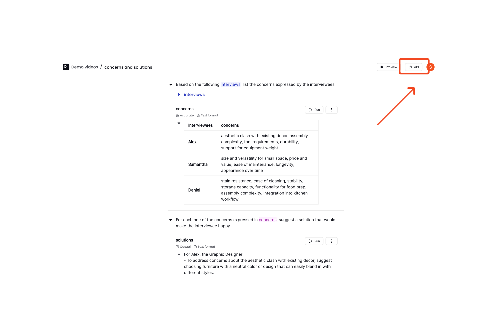
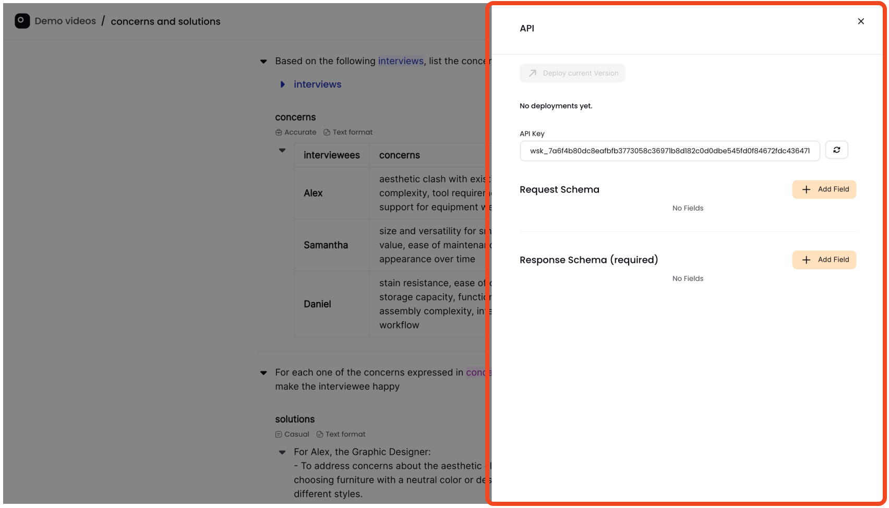
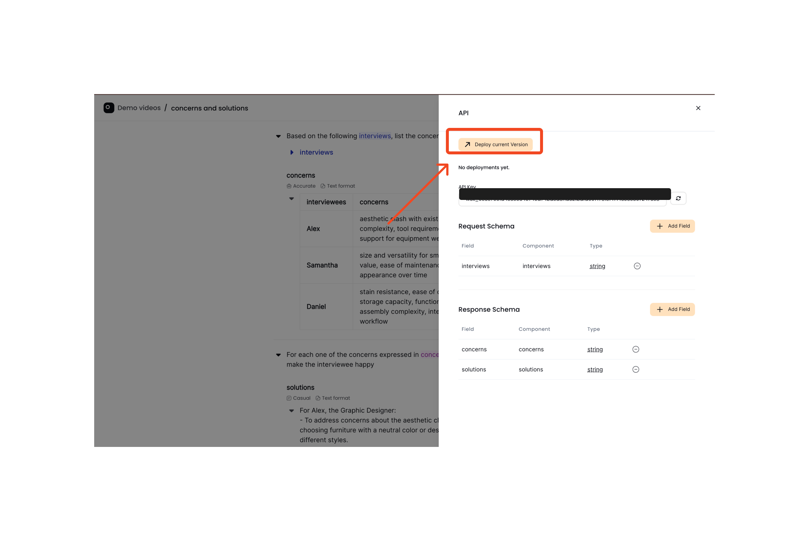
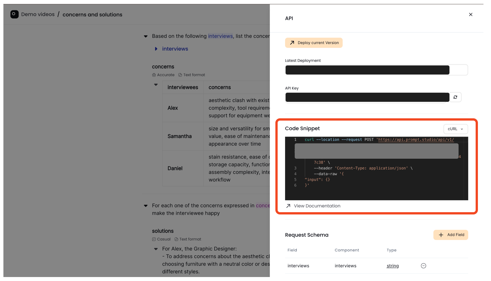

# Deploy your recipe

Deploying your recipe makes it available through the Prompt Studio API so that you can integrate it with your internal systems or with a customer-facing application. 
What this means is that if you call the API endpoint that you expose by deploying the recipe, you can pass inputs to the endpoints, and you will get the output of the request through the API.

## Example use case
We will be using the example recipe that we built earlier [here](../concepts/instructions#chained-instructions-in-a-recipe). The recipe has two instructions. the first instruction extracts concerns expressed by interviewees from a file containing interview scripts. The second instruction suggests solutions to the concerns returned by the first instruction. Let's say that I want to get the output of both the two instructions when I call the endpoint that I deploy.

## Step 1: Locate the API Button

To begin the preview, look for the **API** button situated on the top right side of the recipe page.



## Step 2: Open the API Page

Click the **API** button. This action will open a side bar where you can deploy your recipe.



## Step 3: Define request fields

The request fields are the values that you want to pass to the endpoint from an external source (an external web page input for example). For this [usecase](#example-use-case), I want to pass the file containing the interviews to the request. See below how you can do that:

<div style="position: relative; padding-bottom: 53.22916666666667%; height: 0;"><iframe src="https://www.loom.com/embed/77c29d0683004158a09eb7bff3da0562?sid=675c6f68-82a9-4255-a61e-79d51d89743e" frameborder="0" webkitallowfullscreen mozallowfullscreen allowfullscreen style="position: absolute; top: 0; left: 0; width: 100%; height: 100%;"></iframe></div>

## Step 4: Define response fields

The response fields are the values that you want the endpoint to return to you after the recipe runs via API. As mentioned above regarding this [usecase](#example-use-case), we want the endpoint to return the two outputs `concerns` and `solutions` from the two instructions in the recipe. See below how you can do that:

<div style="position: relative; padding-bottom: 53.22916666666667%; height: 0;"><iframe src="https://www.loom.com/embed/85491177d4a5416c978aade57bf70e3d?sid=3a9bc550-f090-484d-98c0-b05ba26afc98" frameborder="0" webkitallowfullscreen mozallowfullscreen allowfullscreen style="position: absolute; top: 0; left: 0; width: 100%; height: 100%;"></iframe></div>

## Step 5: Deploy your recipe
Now all you need to do is click on the "Deploy current version" button. 


Your recipe is now available via our API:


## Step 6: Your recipe is now available via our API
Since we are passing the interviews to the request (as we set [above](#step-3-define-request-fields)), this is how the API call would look like:

```
curl --location --request POST 'https://api.prompt.studio/api/v1/instructions/{deployment_number}/run' \
    --header 'Authorization: {Bearer_token}' \
    --header 'Content-Type: application/json' \
    --data-raw '{
"input": {
    "interviews": "Interview content"
} 
}'
```

::: warning Prompt Injections

Be aware that inserting user generated text in your prompts might throw off the results, either intentionally: the user tries to override the original instructions you created, or unintentionally due to text passages that are reminiscent of instructions.

:::
