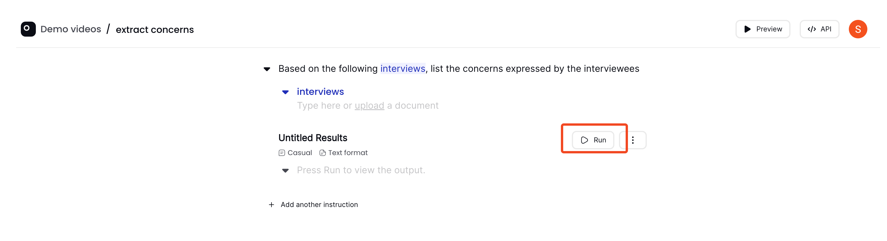

# Run your instructions

You can run your instructions by clicking on the "Run" button:

Here is a video showing how to run the same instruction with different output formats: [text output](../concepts/instructions.md#text-format) and [table output](../concepts/instructions.md#table-format)

<iframe src="https://www.loom.com/embed/c6d07210114c4519b9d9a93cfefa2cd2?sid=f008aa30-4987-4f63-a2f0-a170984a9159" frameborder="0" webkitallowfullscreen mozallowfullscreen allowfullscreen style="position: absolute; top: 0; left: 0; width: 100%; height: 100%;"></iframe>

