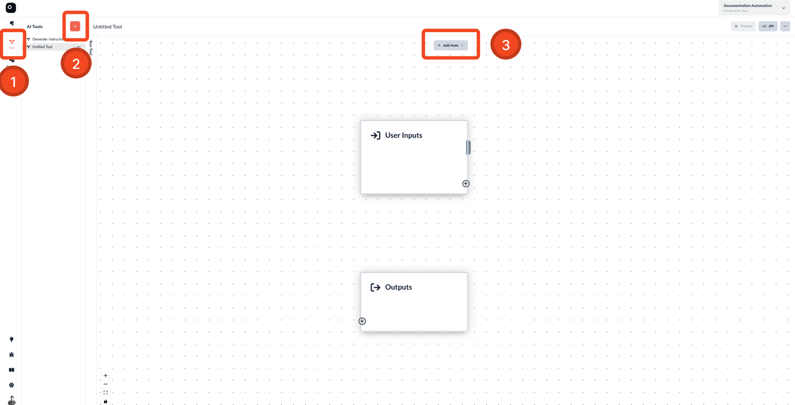
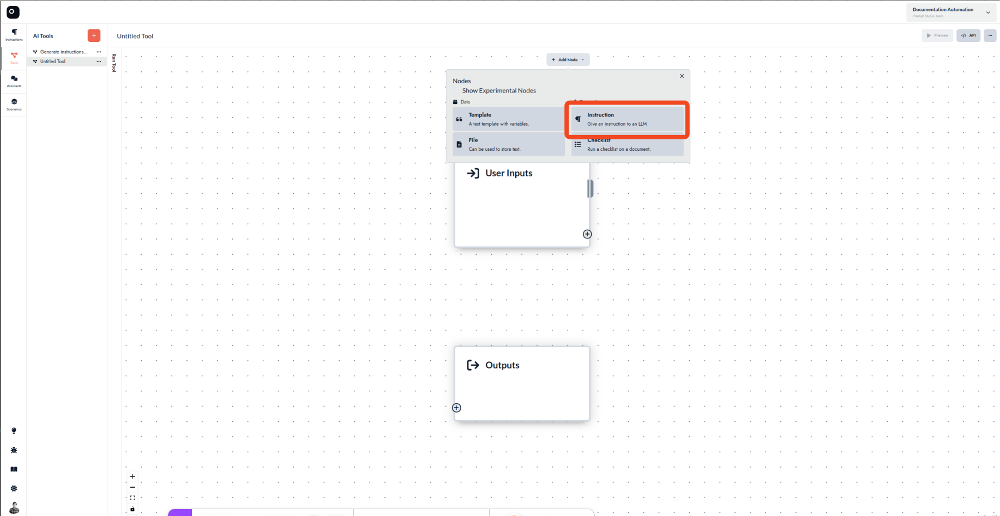
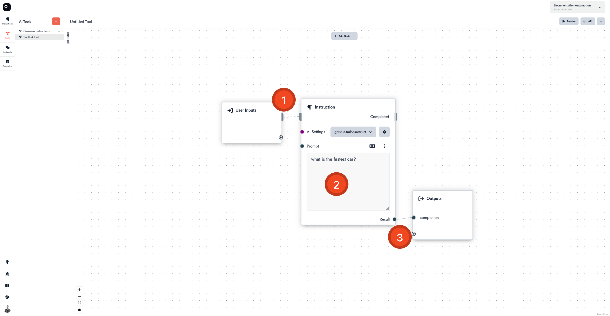
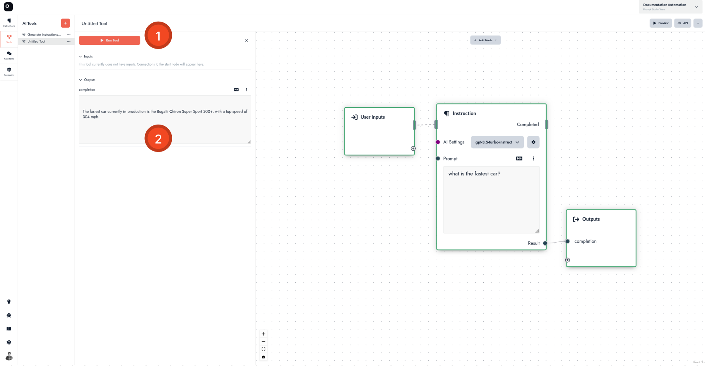

# Build a Tool

This guide provides step-by-step instructions on how to build a tool.

## Step 1: Build your Tool

To start building your tool, follow these steps:

- Open the **Tool** tab in the left sidebar.
- Click on the **Create Tool** button. This action will create a new tool that you can edit in the tool editor.
- To add instructions to the tool, click on the **+ Add node** button.

- Select the **Instruction node**. This node allows you to provide instructions to a language model.

## Step 2: Connecting the Nodes

After adding an instruction node, you need to connect it properly:

- You will see a warning on the instruction node. To resolve this, connect its control input to the **Start** node.
- Add a prompt in the input field of the instruction node. For example, use the prompt: `what is the fastest car in the world?`.
- Connect the result output of the instruction node to the **Output** node.

## Step 3: Running the Tool

To see your tool in action, follow these steps:

- Click on the **Run Tool tab**.
- Press the **Run Tool** button.
- The result will be displayed in the **output** section of the **Run Tool tab**.

