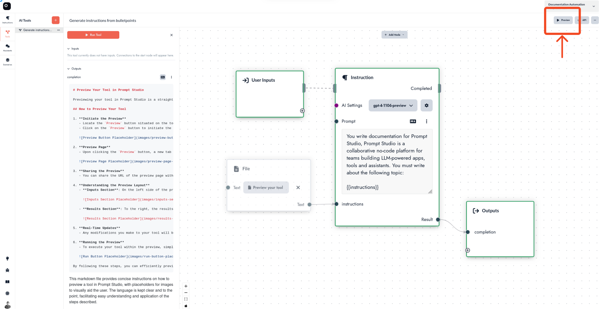
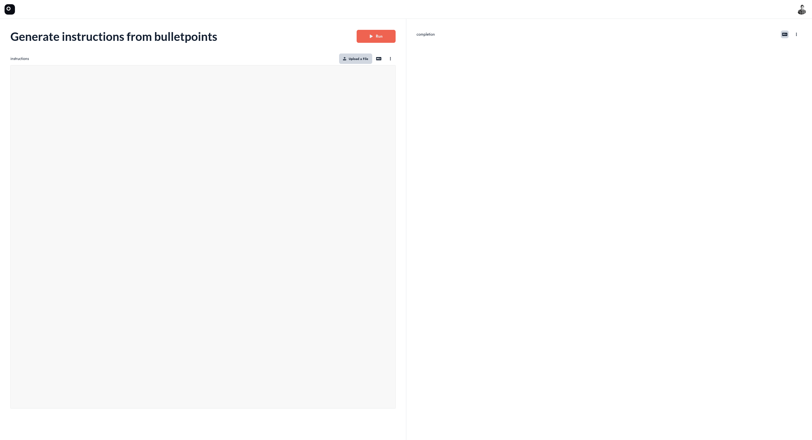
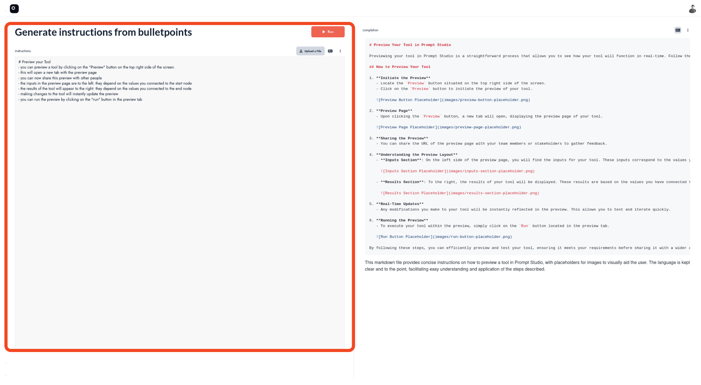
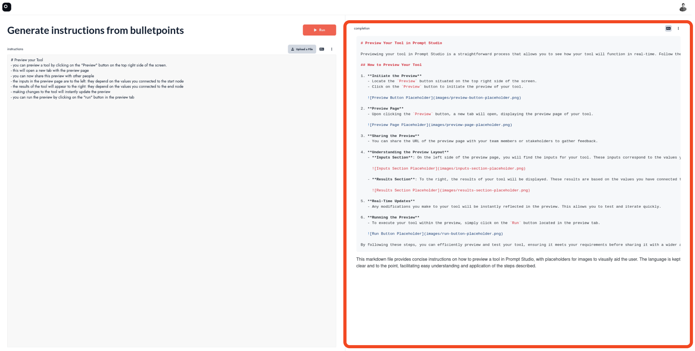
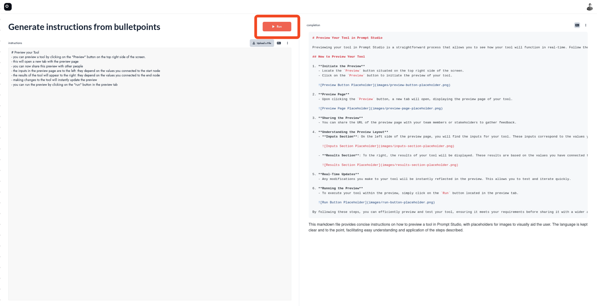

# Preview Your Tool

Previewing your tool in Prompt Studio is a straightforward process that allows you to test and interact with your creation in real-time. Follow these simple steps to see your tool in action:

## Step 1: Locate the Preview Button

To begin the preview, look for the **Preview** button situated on the top right side of the Tool Editor panel.

## Step 2: Open the Preview Page

Click the **Preview** button. This action will open a new browser tab, taking you to the preview page where you can interact with your tool.

## Step 3: Interact with Your Tool

On the preview page, you will find the input fields to the left. These fields are dynamic and will reflect the values and parameters you have connected to the `User Input` node in the tool editor.

To the right, the results of your tool will be displayed. These results are based on the values you have connected to the `Ouput` node.

### Real-Time Updates

Any modifications you make to your tool will be instantly reflected in the preview. This allows you to test and iterate quickly.

## Step 4: Running the Preview

To execute your tool within the preview, simply click on the `Run` button located in the preview tab.

